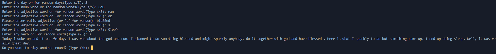

# Day 3: Mad Libs Generator

A console-based Mad libs generator built using pure Python. This project features user input validation, dynamic random strings or words generation, and a continuous main game loop.

<i>Example gameplay showing input validation and random words</i>

## How to Run

1. Ensure Python is installed on your machine.
2. Run the script from your terminal:
   `python mad_libs_generator.py`

## Daily Developer Log

### Day 3: Mad Libs Generator

- **What I built:** A replayable CLI mad libs generator using `random` and nested `while` loops.
- **What broke / what confused me:** I initially struggled with infinite loops and logic because i had never played this game. I had lot of bugs there after implementing the validation of the input. At first, it was really simple taking input and just replacing it in the print command. I was also confused with how to take input of multiple adjective words, i thought of using array to it... maybe in the improvements.
- **What I understand better now:** I understand to nest a `while` loop inside a master `while` loop and to use if conditional statements, and how to use `.lower()` to handle case-sensitive inputs and validate them.
- **Time spent:** Well it took me hours.
- [**DONE**] Committed to GitHub.

## Demo

*The game running in terminal with input validation and random word generation*